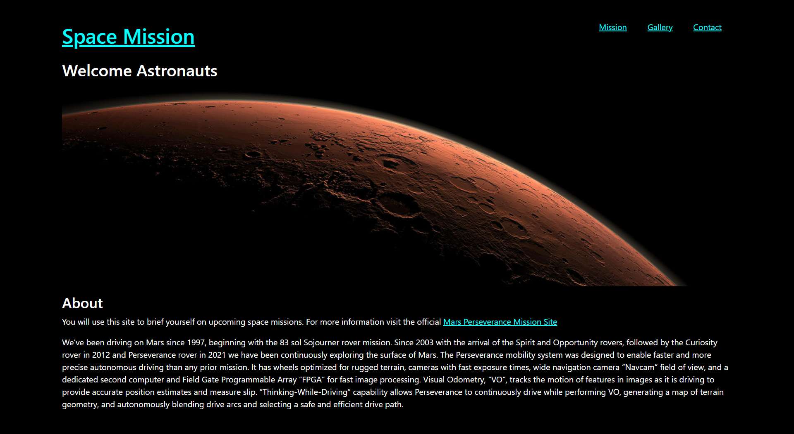
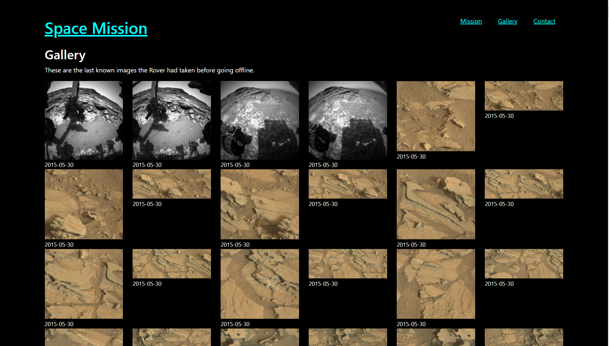

# spaceMission
## General Info
Website application made with React using NASA produced photos. User can interact with the links to see further information.





## Setup
Go to [Official Node.js Website](https://nodejs.org) and download the installer per your operating system.

After node is installed, install the modules by running the following commands in the terminal to install package dependencies.
<br><br>

## Run
Start by targeting the directory:
```
cd space-mission
```
Run the following in the terminal to get dependencies:
```
npm install
```
Dependencies that will be installed:
- axios - v1.3.5
- bootstrap - v5.2.3
- framer-motion - v10.12.4
- react-router-dom - v.6.10.0

Dev Dependencies for github deployment:
- gh-pages - v5.0.0

You can run the application with react by typing the following in the command line:
```
npm start
```

## Technologies
- API from [api.nasa.gov](https://api.nasa.gov/)
- React with bootstrap implemented
- Javascript
- NodeJS

## Deployment

Go to [https://jchen2190.github.io/spaceMission/](https://jchen2190.github.io/spaceMission/)